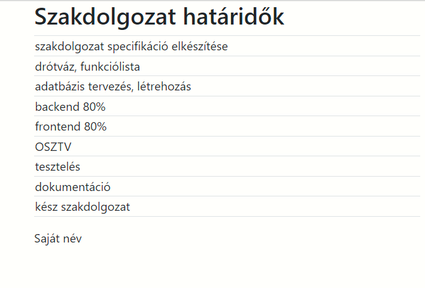

# 01 TODO alapfeladat
Készíts egy osztályt TodoView néven, amely megjeleníti az adatokat egy táblázatban!
Az adatok külön fájlban, egy listában vannak. 
A main.js a program belépési pontja, ide importáld a listát és az osztályt is itt példányosítsd!
Ha jól megy, akkor módosítsd az osztályt úgy, hogy a listában lévő objektumok minden kulcsához tartozó értékeket is meg tudd jeleníteni!

